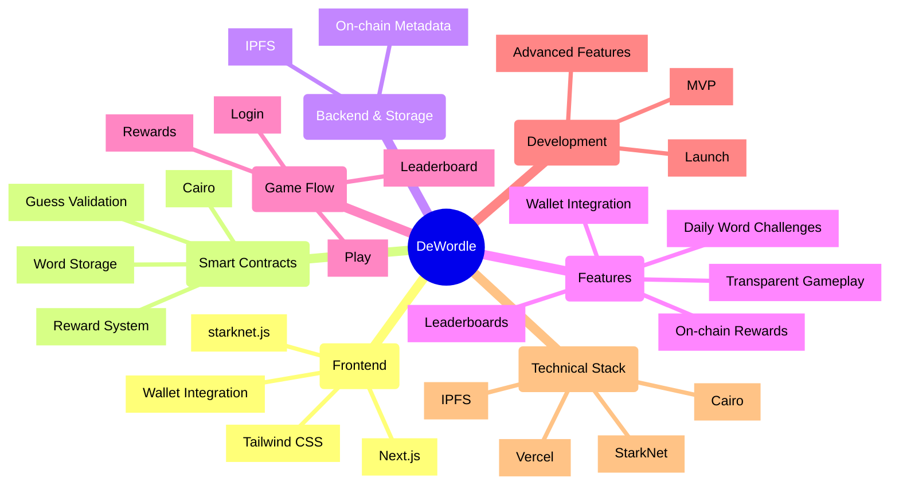

# DeWordle Project Mind Map



## Project Overview

DeWordle is a decentralized word-guessing game built on StarkNet that combines the classic Wordle gameplay with blockchain technology. The mind map above illustrates the key components and their relationships within the project.

### Key Components Explained

1. **Frontend**
   - Built with Next.js for optimal performance
   - Styled using Tailwind CSS
   - Integrates with StarkNet wallets

2. **Smart Contracts**
   - Written in Cairo for StarkNet
   - Handles core game logic
   - Manages rewards and validation

3. **Backend & Storage**
   - Uses IPFS for off-chain data
   - Maintains on-chain metadata
   - Ensures decentralization

4. **Features**
   - Daily word challenges
   - Transparent gameplay
   - Wallet integration
   - On-chain rewards
   - Decentralized leaderboards

5. **Game Flow**
   - User authentication
   - Gameplay mechanics
   - Reward distribution
   - Leaderboard tracking

6. **Development Phases**
   - MVP development
   - Advanced features
   - Launch preparation

7. **Technical Stack**
   - StarkNet for blockchain
   - Vercel for hosting
   - IPFS for storage
   - Cairo for smart contracts
``` 